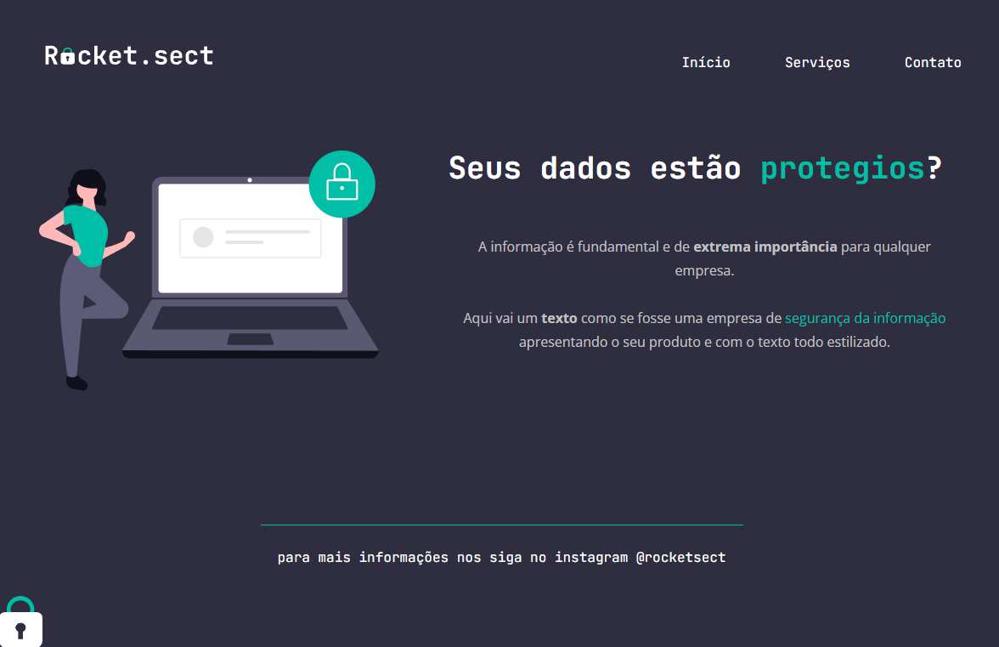

## Projeto 02b (desafio) Rocketseat - Explorer
O desafio era desenvolver a página do zero a partir de um design feito no Figma.
### [Clique aqui para ver o projeto](https://colelladev.github.io/RocketProjeto02b/)

